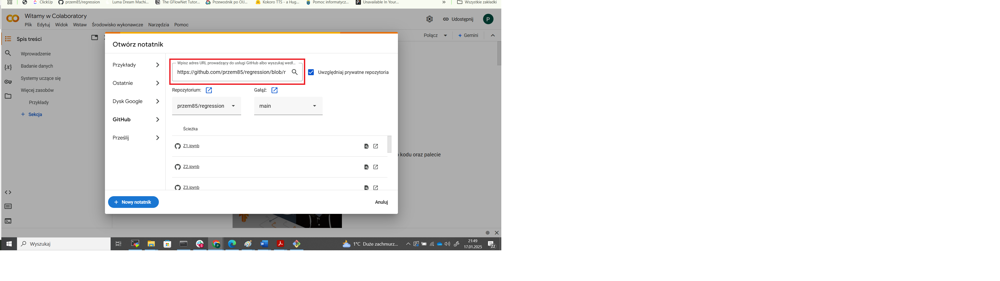

Pliki można otworzyć za pomocą:
https://colab.google/
1. Otwórz lokalizację https://colab.google/ i kliknij ikonę **Open Colab**

2. Następnie kliknij ikonę **GitHub**

2. Wptowadź url zadania np. **[GitHub](https://github.com/przem85/regression/blob/main/Z1.ipynb)**

